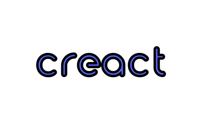

<div align="center" style="text-align:center">
  <a href="https://creact.netlify.app/">
    
  </a>

  <h2 style="padding-top:0;margin-top:20px">creact</h2>
  <h4 style="padding-top:20px">A React web app template with Vite, React Router v7, and TypeScript.</h4>

  <br />

[**Visit demo**](https://creact.netlify.app/) ·
[**Documentation**][wiki]

  <br />

  <p>
    <a href="https://app.netlify.com/sites/creact/deploys">
      
    </a>
    
    
    
  </p>

  <br />

<sub>Developed by <a href="https://joshuabooth.nz">Joshua Booth</a></sub>

  <br />

  <hr />
  <p>
    <a href="#about">About</a> |
    <a href="#requirements">Features</a> |
    <a href="#requirements">Requirements</a> |
    <a href="#installation">Installation</a> |
    <a href="#installation">Setup</a> |
    <a href="#installation">Usage</a> |
    <a href="#support">Support</a> |
    <a href="#license">License</a>
  </p>
  <hr />
</div>

## About

<p style="padding-bottom: 20px">
creact is a React project template for quickly setting up new web applications. Built with:

- **React 19** with concurrent features and automatic batching
- **React Router v7** for file-based routing and data loading
- **Vite** for fast development and optimized production builds
- **TypeScript** for type safety
- **Zustand** for lightweight state management
- **Tailwind CSS v4** for utility-first styling

The template is modular - remove or customize any parts that don't fit your needs.

Take a look at the <a href="#features">features</a> to see what's included. If there's something you think should be added, feel free to create a [feature request](https://github.com/Joshua-Booth/creact/issues/new).

For more information about this project check out the [wiki].

</p>

[wiki]: https://github.com/Joshua-Booth/creact/wiki/Home/

## Features

- :scissors: **Customisable** - Only use the parts you need for your project
- :zap: **Build tooling** - Fast development with [Vite] and [React Router v7]
- :file_folder: **Data management** - State management with [Zustand] and API requests with [axios]
- :iphone: **Responsive design** - Utility-first styling with [Tailwind CSS v4]
- :arrow_right_hook: **Git hooks** - Automated code quality checks with [Husky]
- :bookmark: **Versioning** - Automated SemVer versioning, changelogs, and releases with [semantic-release]
- :shirt: **Linting** - [ESLint], [Prettier], [stylelint], and [commitlint]
- :white_check_mark: **Testing** - Unit and integration tests with [Vitest], E2E tests with [Playwright]
- :chart_with_upwards_trend: **Coverage reports** - Test coverage tracking
- :wrench: **Task runner** - Development workflows with [mise]
- :package: **Third party integrations** - [Algolia], [Sentry], and [PostHog] ready to configure
- :art: **UI components** - [Lucide React] icons and [React Hook Form] for forms

[vite]: https://vite.dev/
[react router v7]: https://reactrouter.com/
[zustand]: https://github.com/pmndrs/zustand
[axios]: https://axios-http.com/
[tailwind css v4]: https://tailwindcss.com/
[husky]: https://github.com/typicode/husky
[semantic-release]: https://github.com/semantic-release/semantic-release
[eslint]: https://eslint.org/
[prettier]: https://prettier.io/
[stylelint]: https://stylelint.io/
[commitlint]: https://commitlint.js.org/#/
[vitest]: https://vitest.dev/
[playwright]: https://playwright.dev/
[mise]: https://mise.jdx.dev/
[algolia]: https://www.algolia.com/
[sentry]: https://sentry.io/
[posthog]: https://posthog.com/
[lucide react]: https://lucide.dev/
[react hook form]: https://react-hook-form.com/

## Requirements

This project requires the following:

- [Git](https://git-scm.com/downloads)
- [Node.js 24.12.0+](https://nodejs.org/en/download/) (or use [mise] to manage versions automatically)
- [pnpm 10.26.0+](https://pnpm.io/installation)

### Recommended setup

Install [mise](https://mise.jdx.dev/) for automatic version management:

```sh
# Install mise (macOS)
brew install mise

# Install mise (other platforms)
curl https://mise.run | sh
```

Once mise is installed, it will automatically install and use the correct Node.js and pnpm versions when you enter the project directory.

### Other useful global dependencies

- [git-cz](https://www.npmjs.com/package/git-cz) for conventional commits
- [prettier](https://www.npmjs.com/package/prettier) for code formatting

## Installation

```sh
# Clone the repository
git clone https://github.com/Joshua-Booth/creact.git

# Change into the 'creact' directory
cd creact

# Install all the project's dependencies
pnpm install
```

**Note:** If you're using mise, the correct Node.js and pnpm versions will be automatically installed and activated when you enter the project directory.

## Setup

Environment variables are configured using `.env` files in the project root. The project includes:

- `.env` - Base configuration (shared across all environments)
- `.env.development` - Development environment settings
- `.env.test` - Test environment settings
- `.env.production` - Production environment settings

For local customization (e.g., custom ports for git worktrees), create a `.env.local` or `.env.development.local` file. These files are gitignored and will override the default settings.

See `.env.example` for a complete list of available configuration options.

### Port Configuration

By default, the application uses:

- Frontend dev server: `http://localhost:8080`
- Backend API server: `http://localhost:8000`

You can customize these ports and configure integrations using environment variables:

| Variable name       | Required | Description                                                                                                   |
| ------------------- | -------- | ------------------------------------------------------------------------------------------------------------- |
| `VITE_PORT`         | False    | Frontend dev server port (default: `8080`)                                                                    |
| `VITE_API_PORT`     | False    | Backend API server port (default: `8000`)                                                                     |
| `VITE_API_ROOT_URL` | True     | Your API's URL (e.g. `http://localhost:8000` for dev and `https://api.example.com/` for prod)                 |
| `VITE_PUBLIC_URL`   | True     | This app's public URL (e.g. `http://localhost:8080/public` for dev and `https://example.com/public` for prod) |
| `VITE_SENTRY_DSN`   | False    | [Sentry DSN] for error tracking and monitoring                                                                |
| `SENTRY_ORG`        | False    | Sentry organization slug (for sourcemap uploads during builds)                                                |
| `SENTRY_PROJECT`    | False    | Sentry project slug (for sourcemap uploads during builds)                                                     |
| `SENTRY_AUTH_TOKEN` | False    | [Sentry auth token] for sourcemap uploads (build only)                                                        |
| `VITE_POSTHOG_KEY`  | False    | [PostHog project API key] for product analytics                                                               |
| `VITE_POSTHOG_HOST` | False    | PostHog API host (default: `https://app.posthog.com`)                                                         |

### Git Worktree Setup

To run multiple branches simultaneously on different ports, create a `.env.development.local` file in each worktree with custom port numbers. Make sure to update all URL variables to match your port configuration:

```sh
# Branch 1 (main) - .env.development.local
VITE_PORT=8080
VITE_API_PORT=8000
VITE_API_ROOT_URL=http://localhost:8000
VITE_PUBLIC_URL=http://localhost:8080/public

# Branch 2 (feature-a) - .env.development.local
VITE_PORT=8081
VITE_API_PORT=8001
VITE_API_ROOT_URL=http://localhost:8001
VITE_PUBLIC_URL=http://localhost:8081/public

# Branch 3 (feature-b) - .env.development.local
VITE_PORT=8082
VITE_API_PORT=8002
VITE_API_ROOT_URL=http://localhost:8002
VITE_PUBLIC_URL=http://localhost:8082/public
```

[sentry dsn]: https://docs.sentry.io/product/sentry-basics/dsn-explainer/
[sentry auth token]: https://docs.sentry.io/api/auth/#auth-tokens
[posthog project api key]: https://posthog.com/docs/getting-started/send-events#how-to-find-your-project-api-key

## Usage

The project uses [mise] for task management. All tasks are defined in `.mise/tasks/`.

### Development

```sh
mise run dev          # Start Vite dev server
```

Visit the site at `http://localhost:8080` (or the port configured in your `.env` file).

### Production

```sh
mise run build        # Build static files for production
mise run preview      # Preview production build locally
```

### Testing

```sh
mise run test         # Run unit/integration tests with Vitest
mise run test_ui      # Open Vitest UI
mise run test_e2e     # Run end-to-end tests with Playwright
mise run test_coverage # Generate test coverage report
```

### Code Quality

```sh
mise run lint         # Run ESLint
mise run stylelint    # Run stylelint
mise run typecheck    # Run TypeScript type checking
mise run format       # Format code with Prettier
```

### Other Tasks

```sh
mise tasks ls         # List all available tasks
mise run clean        # Clean build artifacts
mise run build_analyze # Analyze bundle size
```

For more details on available tasks, check the `.mise/tasks/` directory or run `mise tasks ls`.

## Support

Do you need some help? Check the out articles in the [wiki].

Check the [issues](https://github.com/Joshua-Booth/creact/issues) page to see if there is an open issue with a potential workaround.

### Additional Support

Reach out to me for support through the following methods:

- Email: [contact@joshuabooth.nz](mailto:contact@joshuabooth.nz)
- Website: [joshuabooth.nz/contact](https://joshuabooth.nz)

## License

This project is the sole property of Joshua Booth.

Copyright &copy; 2025 Joshua Booth

Please see individual licenses contained in the project where third-party
code was used, as this code is owned by its respective authors.
